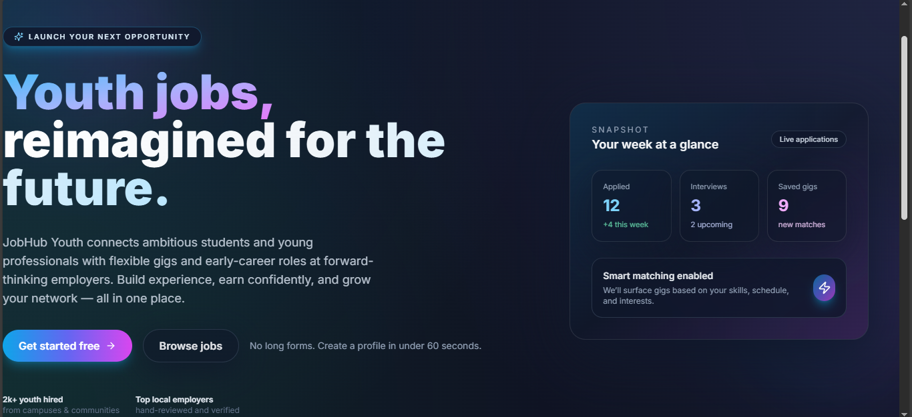
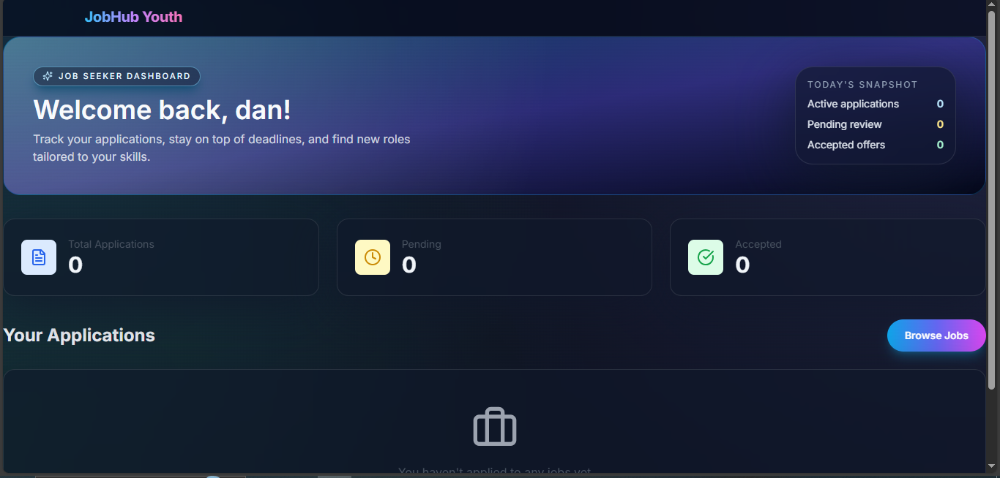
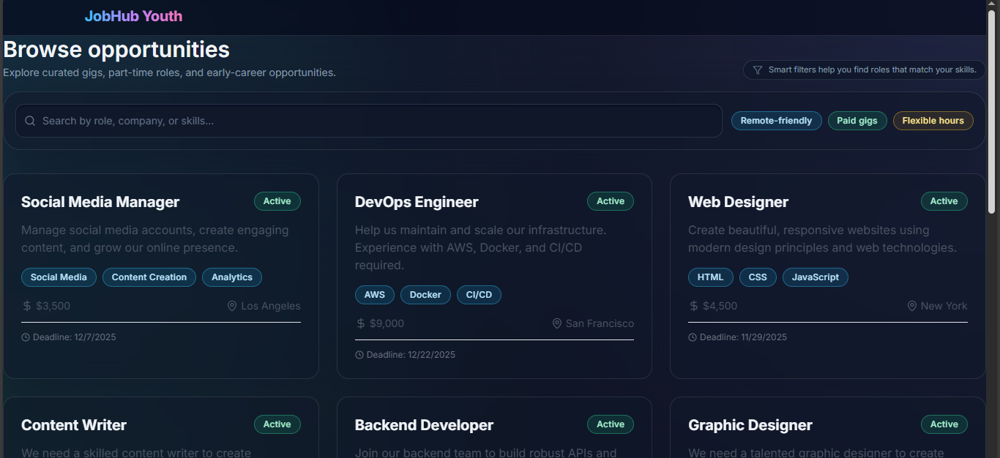

# 🚀 JobHub Youth – MERN Full-Stack Final Project

JobHub Youth is a **full-stack job-matching platform** designed to connect young job seekers with local opportunities.  
It includes job posting, applications, dashboards, authentication, and a modern UI with animations.

This project fulfills the **PLP MERN Final Project** requirements, including:

✔ Full-stack MERN app  
✔ Backend API with authentication  
✔ Frontend with responsive UI  
✔ Database design  
✔ Real-time readiness  
✔ Testing + CI/CD  
✔ Deployment (Render + Vercel)  
✔ Complete documentation  

---

# 📸 Live Demo & Screenshots

### 🎥 Demo Video (Google Drive)  
👉 https://drive.google.com/file/d/1ya6MB4XmmCkbcXR3-xA6Ok1Ci0RK8h0N/view?usp=sharing

### 🌐 Live Deployments
| Service | Link |
|--------|------|
| **Frontend (Vercel)** | https://jobhubyouth.vercel.app |
| **Backend (Render)** | https://jobhub-youth-backend.onrender.com |

---

# 🎯 Project Summary

JobHub Youth is a platform where:

### 👤 Job Seekers can:
- Create an account  
- Browse available jobs  
- View job details  
- Apply to jobs  
- Track their applications in a dashboard  

### 🧑‍💼 Employers can:
- Register and log in  
- Create, update, and delete jobs  
- View applicants  
- Update application status  

---

# ✨ Core Features

### 🔐 Authentication
- JWT-based login & registration  
- Cookies for secure sessions  
- Role-based access control (JOB_SEEKER / EMPLOYER)  

### 📄 Jobs Module
- Create job posts  
- Browse jobs with filters  
- Job details page  
- Employer dashboard  

### 📝 Applications Module
- Apply to jobs  
- Prevent duplicate applications  
- Employer can manage status  
- Application tracking for seekers  

### 🧭 Frontend
- Next.js App Router  
- Beautiful futuristic UI (glassmorphism + gradients)  
- Framer Motion animations  
- Tailwind CSS  
- Fully responsive  

### 🛠 Backend
- Express API  
- MongoDB via Mongoose  
- Middleware (auth, rate limit, validation)  
- Error handling  
- Seed script  

---

# 🏗️ System Architecture

```txt
frontend/ (Next.js)
backend/ (Express + MongoDB)
└── src/
    ├── routes/
    ├── models/
    ├── middleware/
    ├── config/
    ├── seed/
```

The frontend communicates with the backend through REST API calls using the `NEXT_PUBLIC_API_URL`.

---

# 🗄️ Database Schema

### User
```ts
{
  name: string
  email: string
  passwordHash: string
  role: 'JOB_SEEKER' | 'EMPLOYER' | 'ADMIN'
  skills?: string[]
  portfolioLink?: string
  company?: string
}
```

### Job
```ts
{
  employerId: ObjectId (User)
  title: string
  description: string
  requiredSkills: string[]
  budget: number
  rateType: "HOURLY" | "FIXED"
  deadline: Date
  location: { city, state, country }
  status: "ACTIVE" | "CLOSED"
}
```

### Application
```ts
{
  jobId: ObjectId (Job)
  jobSeekerId: ObjectId (User)
  coverLetter?: string
  status: "PENDING" | "REVIEWED" | "INTERVIEWED" | "ACCEPTED" | "REJECTED"
}
```

---

# 🛠️ API Endpoints Overview

## Auth
```http
POST /api/auth/register
POST /api/auth/login
POST /api/auth/logout
GET  /api/auth/me
```

## Users
```http
GET /api/users/:id
PUT /api/users/:id
```

## Jobs
```http
POST   /api/jobs
GET    /api/jobs
GET    /api/jobs/:id
PUT    /api/jobs/:id
DELETE /api/jobs/:id
GET    /api/jobs/my-jobs/list
GET    /api/jobs/:id/applicants
```

## Applications
```http
POST   /api/applications
GET    /api/applications/my-applications/list
PATCH  /api/applications/:id/status
```

---

# ⚙️ Installation & Setup

## 1️⃣ Clone the Repository
```bash
git clone https://github.com/PLP-MERN-Stack-Development/mern-final-project-EronzyD1
cd mern-final-project-EronzyD1
```

---

# 🧩 Backend Setup

```bash
cd backend
npm install
```

### Create `.env`
```env
PORT=5000
MONGO_URI=your_mongo_connection_string
JWT_SECRET=supersecretkey
CORS_ORIGIN=https://jobhubyouth.vercel.app
NODE_ENV=production
```

### Run Locally
```bash
npm run dev
```

### Build
```bash
npm run build
```

---

# 🎨 Frontend Setup

```bash
cd frontend
npm install
```

### Create `.env.local`
```env
NEXT_PUBLIC_API_URL=https://jobhub-youth-backend.onrender.com
```

### Run Locally
```bash
npm run dev
```

---

# 🚀 Deployment Instructions

## Frontend → Vercel
1. Go to Vercel dashboard  
2. Import GitHub repo  
3. Set **Framework** = Next.js  
4. Set **Root Directory** = `frontend`  
5. Add environment variables  
6. Deploy  

---

## Backend → Render
1. Create new **Web Service**  
2. Connect GitHub repo  
3. Root Directory → `backend`  
4. Build Command:
```bash
npm install && npm run build
```
5. Start Command:
```bash
npm start
```
6. Add all environment variables  
7. Deploy

---

# 🔁 CI/CD Configuration

## GitHub Actions Build Workflow

Your repo includes:
```txt
.github/workflows/ci.yml
```

What this workflow does:
- Installs dependencies  
- Builds backend  
- Builds frontend  
- Ensures the project compiles for both sides  
- Runs tests  
- Prevents broken builds from deploying  

Example workflow:

```yaml
name: CI

on:
  push:
    branches: [ "main" ]
  pull_request:
    branches: [ "main" ]

jobs:
  build:
    runs-on: ubuntu-latest

    steps:
      - uses: actions/checkout@v3

      - name: Backend Install
        run: cd backend && npm install

      - name: Backend Test
        run: cd backend && npm test

      - name: Frontend Install
        run: cd frontend && npm install

      - name: Frontend Test
        run: cd frontend && npm test
```

---

# 🧪 Testing

## Backend Tests

Located in:
```txt
backend/tests/
```

Run tests:
```bash
cd backend
npm test
```

This runs the backend build (TypeScript compile) and will fail if there are type or build errors.

---

## Frontend Tests

Located in:
```txt
frontend/tests/
```

Run tests:
```bash
cd frontend
npm test
```

This runs:
```bash
next build
```
Which validates routing, components and types via the Next.js production build pipeline.

---

# 🖼️ Screenshots





```

---

# 📚 Technical Architecture Decisions

- **Frontend:** Next.js App Router for routing & SSR  
- **API:** REST-based architecture  
- **Database:** MongoDB Atlas for scalability  
- **Authentication:** JWT + HttpOnly cookies  
- **Hosting:**
  - Frontend on Vercel for speed  
  - Backend on Render for server hosting  
- **Security:**
  - Rate limiting  
  - CORS restrictions  
  - Input validation via express-validator  

---

# 👨‍💻 Author

**Eromosele Daniel**  
PLP MERN Stack Development – Capstone Project  
GitHub: https://github.com/EronzyD1  

---